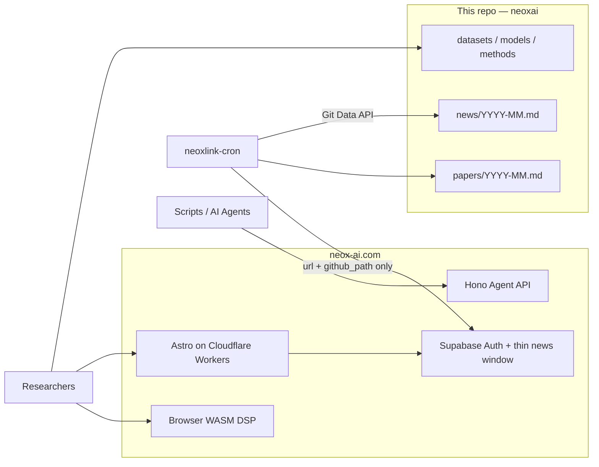

# neoxai

<p align="center">
  <a href="./LICENSE"></a>
  <a href="https://github.com/neowalter/neoxai/stargazers"></a>
  <a href="https://neox-ai.com"></a>
  <a href="https://neox-ai.com/open/"></a>
  <a href="https://api.neox-ai.com/openapi.json"></a>
  <a href="https://github.com/neowalter/neoxai/issues"></a>
  <a href="https://github.com/neowalter/neoxai/commits/main"></a>
</p>

**Curated BCI / EEG hub in Git — and the long-lived archive behind [neox-ai.com](https://neox-ai.com), a community site Agents can actually call.**

This repository is links, licenses, citations, and compact monthly markdown. It is **not** a data lake. No `.edf`, `.fif`, checkpoints, or Git LFS. Raw neural time series in the companion product stay in the browser (WASM); they are never stored here.

**English** | [简体中文](./README.zh-Hans.md)

---

## Why neoxai?

EEG and BCI work is scattered across PhysioNet, OpenNeuro, TUH (research DUA), MOABB, Hugging Face, vendor blogs, and arXiv. The usual workarounds fail in different ways:

| Approach | What goes wrong |
| --- | --- |
| Dump files in Drive / Dropbox | No license, no citation, duplicated PhysioNet, bitrot, and you still cannot tell which *method* belongs with which *corpus* |
| A generic awesome-list | One giant markdown, no monthly paper trail, no ingest filter, no site, no Agent surface |
| Discord / WeChat dumps | Papers and news rot; Agents cannot search or cite a permalink |
| “Just scrape the community HTML” | Fragile, hostile to operators, and useless for onboarding an Agent onto a real site |

**neoxai + neox-ai.com** is the other shape:

- **Curated links + metadata** — dataset, model, and method rows with official URLs, access terms, and a starting citation. Upstream licenses stay upstream; we do not relicense them.
- **Cron-archived papers** — `papers/YYYY-MM.md` (and `news/YYYY-MM.md`) written by the site cron. The website database keeps only a short rolling window; **this repo is the durable bibliography**.
- **Agent API on neox-ai.com** — GitHub OAuth for humans, then (target) API keys / MCP so an Agent can list devices, news, and opportunities without scraping.
- **Local-first EEG** — this hub never hosts recordings. The site is designed so raw EEG is not uploaded; DSP belongs in the browser or on your own machine.

---

## Quick start

Two layers, two honesty levels.

| You want | Status today (August 2026) |
| --- | --- |
| Browse datasets / models / methods / papers | **Live** — this repo and [neox-ai.com/open/](https://neox-ai.com/open/) |
| Sign in with GitHub | **Live** — [neox-ai.com/login/](https://neox-ai.com/login/) (Supabase Auth + Turnstile) |
| First HTTP call to the Agent API | **Live** — unauthenticated catalog (`GET /healthz`, `GET /v1`, `GET /openapi.json`) |
| Mint `nxl_live_…` keys, `GET /v1/usage`, MCP `POST /mcp` | **Not shipped** — specified in the NEOXLINK Agent API doc; OpenAPI already says “MVP skeleton” |

### 1. Get an identity (GitHub OAuth)

1. Open **[https://neox-ai.com/login/](https://neox-ai.com/login/)** (English: [/en/login/](https://neox-ai.com/en/login/)).
2. Complete Turnstile and **Sign in with GitHub**.
3. Session cookies stay on the site (`SameSite=Lax`). That is enough for browser features that use your Supabase JWT.

**API keys** (`nxl_live_<keyid>_<secret>`) are the Agent credential in the target design: issued after this login, shown once, hashed at rest, sent only as `Authorization: Bearer …` to the Worker — never to PostgREST. **There is no keys dashboard and no mint endpoint on the MVP.** Do not invent a key; GitHub secret scanning treats `nxl_live_` as a real secret pattern.

### 2. First Agent call (works now — no key)

The API Worker is public at both of these bases (**same deploy**):

| Base | Role |
| --- | --- |
| `https://neoxlink-api.neoxlink.workers.dev` | Cloudflare `workers.dev` URL — use this if you want the Worker hostname explicitly |
| `https://api.neox-ai.com` | Custom domain on the same Worker |

Machine-readable contract: [`/openapi.json`](https://neoxlink-api.neoxlink.workers.dev/openapi.json). Design (keys, scopes, MCP, four-layer rate limits): **NEOXLINK `docs/02-agent-api.md`** in the site monorepo.

**cURL**

```bash
# liveness
curl -sS https://neoxlink-api.neoxlink.workers.dev/healthz

# v1 catalog (MVP placeholder)
curl -sS https://api.neox-ai.com/v1

# OpenAPI 3.1
curl -sS https://api.neox-ai.com/openapi.json
```

**Python 3** (stdlib only)

```python
import json
import urllib.request

# Either base is fine; both hit the live Worker.
BASE = "https://neoxlink-api.neoxlink.workers.dev"
# BASE = "https://api.neox-ai.com"

with urllib.request.urlopen(f"{BASE}/v1") as response:
    print(json.dumps(json.load(response), indent=2))
```

Expected catalog shape today:

```json
{
  "name": "NEOXLINK API",
  "version": "v1",
  "status": "mvp-placeholder",
  "resources": ["/v1/posts", "/v1/devices", "/v1/opportunities"]
}
```

`GET /v1/posts` and `GET /v1/devices` currently return **501**. `GET /v1/opportunities` lists open rows when Supabase is bound.

### 3. First *keyed* Agent call (target — not live)

When the keys UI ships, the loop is: GitHub login → create a key → call the Worker:

```bash
export NEOX_API_KEY='nxl_live_<keyid>_<secret>'  # shown once; never commit

curl -sS https://api.neox-ai.com/v1/usage \
  -H "Authorization: Bearer $NEOX_API_KEY"
```

```python
import os
import urllib.request

req = urllib.request.Request(
    "https://api.neox-ai.com/v1/usage",
    headers={"Authorization": f"Bearer {os.environ['NEOX_API_KEY']}"},
)
with urllib.request.urlopen(req) as response:
    print(response.read().decode())
```

Target MCP (Streamable HTTP, not routed on the MVP Worker): `POST https://api.neox-ai.com/mcp` with the same Bearer token or an OAuth access token. Until then, treat `/v1` + OpenAPI as the honest surface.

---

## What’s in this repo

```
README.md                 this file (English)
README.zh-Hans.md         Simplified Chinese
LICENSE                   CC-BY-4.0 for *our* docs and archive metadata
CITATION.cff              how to cite the hub
datasets/README.md        EEG / BCI / MEG corpora (links, not files)
models/README.md          decoding + foundation models (GitHub / Hugging Face)
methods/README.md         MNE, PREP, BIDS, local-first / WASM notes
news/README.md            industry-news archive format
news/YYYY-MM.md           monthly news (cron)
papers/README.md          paper archive format
papers/YYYY-MM.md         monthly papers (arXiv / bioRxiv / medRxiv / journals)
```

No Git LFS. A PR that adds a large blob will be rejected.

### Datasets (full table)

Access terms vary. Several corpora need a DUA, an application, or a PhysioNet login. Listed here ≠ redistributable. Canonical table: [`datasets/README.md`](./datasets/README.md).

| Dataset | What it is | Official access | License / access | Cite (start here) |
| --- | --- | --- | --- | --- |
| EEG Motor Movement/Imagery (EEGMMI) | 64-ch BCI2000 MI / movement | [PhysioNet eegmmidb](https://physionet.org/content/eegmmidb/1.0.0/) | PhysioNet open access | Schalk et al., *IEEE TBME*, 2004; Goldberger et al., *Circulation*, 2000 |
| CHB-MIT Scalp EEG | Pediatric seizure scalp EEG | [PhysioNet chbmit](https://physionet.org/content/chbmit/1.0.0/) | PhysioNet open access | Shoeb, MIT PhD, 2009; PhysioNet |
| Sleep-EDF | Sleep polysomnography (EEG/EOG/EMG) | [PhysioNet sleep-edfx](https://physionet.org/content/sleep-edfx/1.0.0/) | PhysioNet open access | Kemp et al.; PhysioNet |
| BCI Competition IV | Classic MI / P300 / motor benchmarks | [bbci.de/competition/iv](https://www.bbci.de/competition/iv/) | Competition terms (research) | Tangermann et al., *Front. Neurosci.*, 2012 |
| BNCI Horizon 2020 | Many organized BCI sets (2a, 2b, …) | [BNCI database](http://bnci-horizon-2020.eu/database/data-sets) | Per-dataset | Original competition / paper per set |
| MOABB | Unified Python access to many BCI sets | [NeuroTechX/moabb](https://github.com/NeuroTechX/moabb) | BSD-3 (library); data licenses vary | Jayaram & Barachant, *JMLR*, 2018 |
| High-Gamma Dataset | High-γ / motor EEG, ConvNet paper | [robintibor/high-gamma-dataset](https://github.com/robintibor/high-gamma-dataset) | See repo | Schirrmeister et al., *HBM*, 2017 |
| TUH EEG (TUEG) and subsets | Large clinical EEG (used by several foundation models) | [TUH EEG](https://isip.piconepress.com/projects/nedc/html/tuh_eeg/) | **Registration + research DUA; not a public dump** | Obeid & Picone, *Front. Neurosci.*, 2016 |
| ERP CORE | Optimized ERP experiments | [erpinfo.org/erp-core](https://erpinfo.org/erp-core) | CC-BY (confirm on page) | Kappenman et al., *NeuroImage*, 2021 |
| Things-EEG / Things-EEG2 | RSVP / visual decoding EEG | [Things-EEG2 (OSF)](https://osf.io/3jk45/) | OSF terms / CC as stated on OSF | Gifford et al.; see OSF wiki |
| DEAP | Emotion (EEG + peripheral) | [DEAP](https://www.eecs.qmul.ac.uk/mmv/datasets/deap/) | **Application required** | Koelstra et al., *IEEE Trans. Affect. Comput.*, 2012 |
| SEED / SEED-IV / SEED-V | Emotion EEG (SJTU BCMI) | [BCMI SEED](https://bcmi.sjtu.edu.cn/home/seed/) | **Application required** | Zheng & Lu and follow-ups |
| OpenNeuro EEG/MEG | BIDS-formatted public scans | [openneuro.org](https://openneuro.org) (filter EEG/MEG) | Per-dataset (often CC0 / CC-BY) | Dataset accession + paper |
| MNE-Python sample | Tiny FIF for tutorials | [mne.datasets.sample](https://mne.tools/stable/documentation/datasets.html) | MNE sample license | Gramfort et al., *Front. Neurosci.*, 2013 |
| Helsinki neonatal EEG | Term-infant scalp EEG | [zenodo 1250690](https://zenodo.org/records/1250690) (confirm current DOI) | CC as on Zenodo | Stevenson et al. |
| ZuCo | EEG + eye tracking while reading | [OSF ZuCo](https://osf.io/q3zws/) | OSF / paper terms | Hollenstein et al. |
| Grasp-and-Lift EEG | Kaggle motor EEG | [Kaggle grasp-and-lift](https://www.kaggle.com/c/grasp-and-lift-eeg-detection/data) | Kaggle + original DUA | Luciw et al. / contest page |

### Models and methods

Weights stay upstream. Full tables: [`models/README.md`](./models/README.md), [`methods/README.md`](./methods/README.md).

| Model / library | Kind | Links |
| --- | --- | --- |
| EEGNet | Compact CNN for BCI | [arl-eegmodels](https://github.com/vlawhern/arl-eegmodels) |
| Deep/Shallow ConvNet | CNN baselines | [braindecode](https://github.com/braindecode/braindecode) |
| LaBraM | Large brain model (EEG tokens) | [935963004/LaBraM](https://github.com/935963004/LaBraM) |
| BENDR | Transformer + contrastive EEG | [SPOClab-ca/BENDR](https://github.com/SPOClab-ca/BENDR) |
| MOABB | Benchmark harness | [NeuroTechX/moabb](https://github.com/NeuroTechX/moabb) |
| MNE-Python | Load, filter, ICA, viz | [mne.tools](https://mne.tools) |

Confirm **training-data license** before you ship a fine-tune (TUH is not “download and redistribute”). Prefer official model cards over anonymous mirrors.

---

## How the cron archive works

The site runs **one** Cloudflare Cron Trigger (`neoxlink-cron`):

| | |
| --- | --- |
| Schedule | `23 */6 * * *` (UTC), every six hours |
| Feeds | Allowlisted RSS/Atom only (arXiv API + `cs.HC` / `q-bio.NC` / `eess.SP`, bioRxiv/medRxiv, Frontiers Neuroprosthetics, OpenBCI forum, Neurosity blog, OpenBCI_GUI releases) |
| Filter | Title + abstract must match BCI / EEG / MEG / neural-interface / EEG-foundation keywords (vendor/community sources already on-theme may pass). Mismatches are dropped. |
| Write | GitHub **Git Data API**, **one commit per run**, ≤20 file updates. Author: `neoxai-bot`. |
| Site DB | After a successful commit, Supabase `news_items` keeps a **thin pointer** (`url` + `github_path`) for the rolling window only: **last 30 days ∩ last 50 rows**. Older rows are deleted. |

Google Scholar is not RSS; cron does not use it.

Example record in [`papers/2026-08.md`](./papers/2026-08.md):

```markdown
### EEG foundation models for motor imagery BCI

- url: https://arxiv.org/abs/2608.24887
- source: arxiv-api-bci
- published: 2026-08-28T02:28:20.000Z
- arxiv: 2608.24887
- summary: Plain-text excerpt, truncated to 400 characters.
```

Cron **does not** store article HTML, PDFs, or feed secrets. Commits never contain tokens. Treat monthly files as a bibliography of links, not a reprint server.

---

## Architecture and roadmap



| Piece | What it is | What it is not |
| --- | --- | --- |
| **This GitHub repo** | Curated markdown: datasets, models, methods, news, papers | A place for GB-scale binaries or raw EEG |
| **Site** | Cloudflare Workers (web + API + cron) + Supabase | An upload API for neural recordings |
| **Browser** | Intended home for filtering / spectra (WASM) | Implemented on day one — the DSP package is still empty; still **do not upload raw EEG** |
| **API Worker** | Live `/healthz`, `/v1`, `/openapi.json` | Full REST, API keys, or MCP yet |

**Roadmap** (site + hub, not a promise of dates):

1. **MCP tools** — Streamable HTTP `POST /mcp`, OAuth 2.1 / PKCE, tools such as `list_datasets`, `list_news`, `get_device`, `match_opportunity` (see Agent API doc).
2. **Matching** — semantic match of people / skills / opportunities (`match_opportunity`); embeddings stay off the public PostgREST surface.
3. **WASM DSP packages** — Rust → WASM filter, resample, FFT/PSD in the browser, numerically aligned with MNE where it matters. No server-side substitute that takes raw EEG.
4. **API keys + usage** — mint after GitHub login, `GET /v1/usage`, rotate/revoke, GitHub secret scanning on `nxl_live_`.

---

## Contributing

1. **Datasets / models / methods** — open a PR that adds a row to the folder README (`datasets/`, `models/`, or `methods/` — source of truth) and the matching table in this file if it is mirrored: name, official URL, license (or “application required”), and a citation (DOI or paper). Prefer sources that are actually obtainable (PhysioNet, OpenNeuro, MOABB, Hugging Face, GitHub).
2. **Do not** attach data files, checkpoints, or `git-lfs` pointers. Reject PRs that only point at a personal Drive of copied PhysioNet files.
3. **News / papers** — do not hand-edit monthly files to “fix” cron output unless a URL is wrong; the next run appends by URL. To change *what* is ingested, propose a feed / keyword-filter change in the site cron, not a one-off rewrite here.
4. Keep summaries factual. **No clinical advice, no medical-device claims.**

Issues and PRs are welcome. This is a curated list, not a mirror of the entire internet.

---

## How to cite

**This hub** (the curation and archive files we authored):

> neowalter. (2026). *neoxai: curated BCI/EEG datasets, models, methods, and news archives*. GitHub. https://github.com/neowalter/neoxai CC-BY-4.0

See [`CITATION.cff`](./CITATION.cff).

**Each dataset, model, or paper** must be cited under **its own** license and preferred citation (usually a data descriptor or the original article). Copying a row from `datasets/README.md` is not a substitute for the upstream citation.

---

## License

| Material | License |
| --- | --- |
| README files, curated tables, cron archive metadata in `news/` and `papers/` | [CC-BY-4.0](./LICENSE) |
| Linked datasets, weights, code, PDFs | **Original licenses only** — we do not relicense them |

There is no medical-device warranty. Nothing here is clinical advice.

---

## 中文速览

**neoxai** 是脑机接口 / EEG 的精选链接枢纽，也是 [neox-ai.com](https://neox-ai.com) 的长期归档仓：站点库只留最近资讯指针，论文与新闻全文元数据写在 `papers/YYYY-MM.md`、`news/YYYY-MM.md`。本仓不托管原始脑电。

- 登录：[neox-ai.com/login/](https://neox-ai.com/login/)（GitHub OAuth）
- 现网 API：`https://neoxlink-api.neoxlink.workers.dev` 与 `https://api.neox-ai.com`（同一 Worker）。今天可无密钥调用 `GET /v1`；API Key / MCP 仍是目标能力。
- 完整中文说明：[README.zh-Hans.md](./README.zh-Hans.md)
