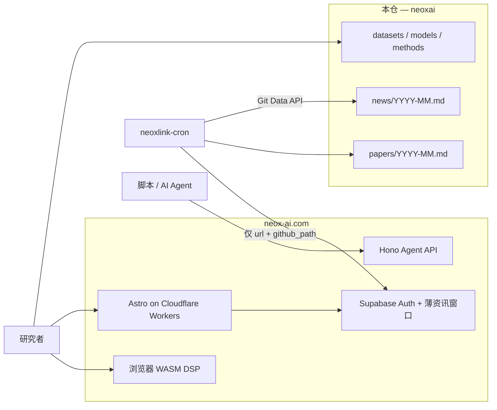

# neoxai

<p align="center">
  <a href="./LICENSE"></a>
  <a href="https://github.com/neowalter/neoxai/stargazers"></a>
  <a href="https://neox-ai.com"></a>
  <a href="https://neox-ai.com/open/"></a>
  <a href="https://api.neox-ai.com/openapi.json"></a>
  <a href="https://github.com/neowalter/neoxai/issues"></a>
  <a href="https://github.com/neowalter/neoxai/commits/main"></a>
</p>

**Git 里的精选 BCI / EEG 枢纽，也是 [neox-ai.com](https://neox-ai.com) 背后可被 Agent 调用的长期归档。**

本仓库只有链接、许可、引用和紧凑的按月 Markdown。**不是数据湖。** 没有 `.edf`、`.fif`、权重文件或 Git LFS。配套产品里的原始神经时序留在浏览器（WASM），不会进本仓。

[English](./README.md) | **简体中文**

---

## 为什么是 neoxai？

EEG / BCI 资源散落在 PhysioNet、OpenNeuro、TUH（研究 DUA）、MOABB、Hugging Face、厂商博客和 arXiv。常见权宜之计会在不同地方翻车：

| 做法 | 问题 |
| --- | --- |
| 把文件扔进网盘 | 无许可、无引用、重复搬运 PhysioNet、链接腐烂，而且分不清哪套 *方法* 对应哪份 *数据* |
| 一份泛泛的 awesome-list | 一篇超长 Markdown，没有按月论文轨迹、没有摄入过滤、没有站点、没有 Agent 接口 |
| Discord / 微信群搬运 | 论文和资讯会烂掉；Agent 无法检索或引用permalink |
| 「去爬社区 HTML」 | 脆弱、对运营方不友好，也无法让 Agent 正规接入一个真实站点 |

**neoxai + neox-ai.com** 是另一种形状：

- **精选链接 + 元数据** — 数据集、模型、方法行带官方 URL、获取条件、起始引用。上游许可仍归上游，我们不重新授权。
- **定时归档论文** — `papers/YYYY-MM.md`（以及 `news/YYYY-MM.md`）由站点 cron 写入。站点数据库只留短滚动窗口；**本仓才是耐久书目**。
- **neox-ai.com 上的 Agent API** — 人类走 GitHub OAuth，目标形态下再用 API Key / MCP，让 Agent 列出设备、资讯、机会，而不去刮页面。
- **本地优先的 EEG** — 本枢纽不托管记录。站点设计上不上传原始 EEG；DSP 属于浏览器或你自己的机器。

---

## 快速开始

两层能力，两档诚实。

| 你想做的事 | 今天的状态（2026 年 8 月） |
| --- | --- |
| 浏览数据集 / 模型 / 方法 / 论文 | **已上线** — 本仓与 [neox-ai.com/open/](https://neox-ai.com/open/) |
| 用 GitHub 登录 | **已上线** — [neox-ai.com/login/](https://neox-ai.com/login/)（Supabase Auth + Turnstile） |
| 对 Agent API 发出第一次 HTTP 调用 | **已上线** — 无需密钥的目录（`GET /healthz`、`GET /v1`、`GET /openapi.json`） |
| 签发 `nxl_live_…`、`GET /v1/usage`、MCP `POST /mcp` | **尚未交付** — 写在 NEOXLINK Agent API 文档里；OpenAPI 已标明 “MVP skeleton” |

### 1. 取得身份（GitHub OAuth）

1. 打开 **[https://neox-ai.com/login/](https://neox-ai.com/login/)**（英文：[/en/login/](https://neox-ai.com/en/login/)）。
2. 完成 Turnstile，再 **使用 GitHub 登录**。
3. 会话 cookie 留在站点（`SameSite=Lax`）。浏览器功能若走你的 Supabase JWT，这就够了。

**API Key**（`nxl_live_<keyid>_<secret>`）是目标设计里的 Agent 凭据：登录后签发、只展示一次、库内只存哈希，仅作为 `Authorization: Bearer …` 发给 Worker — 绝不直连 PostgREST。**MVP 没有密钥控制台，也没有签发接口。** 不要自己编一把；GitHub secret scanning 会把 `nxl_live_` 当成真实密钥模式。

### 2. 第一次 Agent 调用（现在就能跑 — 无需密钥）

API Worker 在下面两个基址上公开（**同一次部署**）：

| 基址 | 角色 |
| --- | --- |
| `https://neoxlink-api.neoxlink.workers.dev` | Cloudflare `workers.dev` 主机名 |
| `https://api.neox-ai.com` | 同一 Worker 上的自定义域 |

机读契约：[`/openapi.json`](https://neoxlink-api.neoxlink.workers.dev/openapi.json)。设计（密钥、scope、MCP、四层限流）：站点单体仓中的 **NEOXLINK `docs/02-agent-api.md`**。

**cURL**

```bash
# 探活
curl -sS https://neoxlink-api.neoxlink.workers.dev/healthz

# v1 目录（MVP 占位）
curl -sS https://api.neox-ai.com/v1

# OpenAPI 3.1
curl -sS https://api.neox-ai.com/openapi.json
```

**Python 3**（仅标准库）

```python
import json
import urllib.request

# 两个基址都可以；都打到现网 Worker。
BASE = "https://neoxlink-api.neoxlink.workers.dev"
# BASE = "https://api.neox-ai.com"

with urllib.request.urlopen(f"{BASE}/v1") as response:
    print(json.dumps(json.load(response), indent=2))
```

今天目录的形态：

```json
{
  "name": "NEOXLINK API",
  "version": "v1",
  "status": "mvp-placeholder",
  "resources": ["/v1/posts", "/v1/devices", "/v1/opportunities"]
}
```

`GET /v1/posts` 与 `GET /v1/devices` 目前返回 **501**。绑定了 Supabase 时，`GET /v1/opportunities` 会列出开放的机会行。

### 3. 第一次 *带密钥* 的 Agent 调用（目标 — 尚未上线）

密钥 UI 上线后，闭环是：GitHub 登录 → 创建密钥 → 调用 Worker：

```bash
export NEOX_API_KEY='nxl_live_<keyid>_<secret>'  # 只展示一次；不要提交

curl -sS https://api.neox-ai.com/v1/usage \
  -H "Authorization: Bearer $NEOX_API_KEY"
```

```python
import os
import urllib.request

req = urllib.request.Request(
    "https://api.neox-ai.com/v1/usage",
    headers={"Authorization": f"Bearer {os.environ['NEOX_API_KEY']}"},
)
with urllib.request.urlopen(req) as response:
    print(response.read().decode())
```

目标 MCP（Streamable HTTP，MVP Worker 尚未挂路由）：`POST https://api.neox-ai.com/mcp`，使用同一 Bearer 或 OAuth access token。在那之前，把 `/v1` + OpenAPI 当作诚实的对外表面。

---

## 本仓有什么

```
README.md                 英文说明（GitHub 默认）
README.zh-Hans.md         本文件
LICENSE                   我们撰写的文档与归档元数据：CC-BY-4.0
CITATION.cff              如何引用本枢纽
datasets/README.md        EEG / BCI / MEG 语料（链接，不是文件）
models/README.md          解码与基础模型（GitHub / Hugging Face）
methods/README.md         MNE、PREP、BIDS、本地优先 / WASM 笔记
news/README.md            行业资讯归档格式
news/YYYY-MM.md           按月资讯（cron）
papers/README.md          论文归档格式
papers/YYYY-MM.md         按月论文（arXiv / bioRxiv / medRxiv / 期刊）
```

没有 Git LFS。带上大二进制的 PR 会被拒绝。

### 数据集（完整表）

获取条件各不相同。若干语料需要 DUA、申请表或 PhysioNet 登录。出现在表里 ≠ 可以再分发。权威表：[`datasets/README.md`](./datasets/README.md)。

| 数据集 | 内容 | 官方获取 | 许可 / 获取 | 引用（从这里开始） |
| --- | --- | --- | --- | --- |
| EEG Motor Movement/Imagery (EEGMMI) | 64 导 BCI2000 运动 / 想象 | [PhysioNet eegmmidb](https://physionet.org/content/eegmmidb/1.0.0/) | PhysioNet 开放获取 | Schalk et al., *IEEE TBME*, 2004; Goldberger et al., *Circulation*, 2000 |
| CHB-MIT Scalp EEG | 儿童癫痫头皮 EEG | [PhysioNet chbmit](https://physionet.org/content/chbmit/1.0.0/) | PhysioNet 开放获取 | Shoeb, MIT PhD, 2009; PhysioNet |
| Sleep-EDF | 睡眠多导（EEG/EOG/EMG） | [PhysioNet sleep-edfx](https://physionet.org/content/sleep-edfx/1.0.0/) | PhysioNet 开放获取 | Kemp et al.; PhysioNet |
| BCI Competition IV | 经典 MI / P300 / 运动基准 | [bbci.de/competition/iv](https://www.bbci.de/competition/iv/) | 竞赛条款（研究） | Tangermann et al., *Front. Neurosci.*, 2012 |
| BNCI Horizon 2020 | 多套整理过的 BCI（2a、2b、…） | [BNCI database](http://bnci-horizon-2020.eu/database/data-sets) | 按数据集 | 原竞赛 / 论文 |
| MOABB | 用 Python 统一访问多套 BCI | [NeuroTechX/moabb](https://github.com/NeuroTechX/moabb) | BSD-3（库）；数据许可各异 | Jayaram & Barachant, *JMLR*, 2018 |
| High-Gamma Dataset | 高 γ / 运动 EEG，ConvNet 论文 | [robintibor/high-gamma-dataset](https://github.com/robintibor/high-gamma-dataset) | 见仓库 | Schirrmeister et al., *HBM*, 2017 |
| TUH EEG (TUEG) 及子集 | 大规模临床 EEG（多个基础模型用过） | [TUH EEG](https://isip.piconepress.com/projects/nedc/html/tuh_eeg/) | **注册 + 研究 DUA；不是公开打包下载** | Obeid & Picone, *Front. Neurosci.*, 2016 |
| ERP CORE | 优化过的 ERP 实验 | [erpinfo.org/erp-core](https://erpinfo.org/erp-core) | CC-BY（以页面为准） | Kappenman et al., *NeuroImage*, 2021 |
| Things-EEG / Things-EEG2 | RSVP / 视觉解码 EEG | [Things-EEG2 (OSF)](https://osf.io/3jk45/) | OSF 条款 / OSF 上声明的 CC | Gifford et al.; 见 OSF wiki |
| DEAP | 情绪（EEG + 外周） | [DEAP](https://www.eecs.qmul.ac.uk/mmv/datasets/deap/) | **需要申请** | Koelstra et al., *IEEE Trans. Affect. Comput.*, 2012 |
| SEED / SEED-IV / SEED-V | 情绪 EEG（上海交大 BCMI） | [BCMI SEED](https://bcmi.sjtu.edu.cn/home/seed/) | **需要申请** | Zheng & Lu 及后续 |
| OpenNeuro EEG/MEG | BIDS 公开扫描 | [openneuro.org](https://openneuro.org)（筛 EEG/MEG） | 按数据集（常见 CC0 / CC-BY） | 数据集编号 + 论文 |
| MNE-Python sample | 教程用小 FIF | [mne.datasets.sample](https://mne.tools/stable/documentation/datasets.html) | MNE sample 许可 | Gramfort et al., *Front. Neurosci.*, 2013 |
| Helsinki neonatal EEG | 足月新生儿头皮 EEG | [zenodo 1250690](https://zenodo.org/records/1250690)（请核对当前 DOI） | Zenodo 上的 CC | Stevenson et al. |
| ZuCo | 阅读时的 EEG + 眼动 | [OSF ZuCo](https://osf.io/q3zws/) | OSF / 论文条款 | Hollenstein et al. |
| Grasp-and-Lift EEG | Kaggle 运动 EEG | [Kaggle grasp-and-lift](https://www.kaggle.com/c/grasp-and-lift-eeg-detection/data) | Kaggle + 原始 DUA | Luciw et al. / 竞赛页 |

### 模型与方法

权重留在上游。完整表：[`models/README.md`](./models/README.md)、[`methods/README.md`](./methods/README.md)。

| 模型 / 库 | 类型 | 链接 |
| --- | --- | --- |
| EEGNet | 紧凑 CNN，面向 BCI | [arl-eegmodels](https://github.com/vlawhern/arl-eegmodels) |
| Deep/Shallow ConvNet | CNN 基线 | [braindecode](https://github.com/braindecode/braindecode) |
| LaBraM | 大规模脑模型（EEG token） | [935963004/LaBraM](https://github.com/935963004/LaBraM) |
| BENDR | Transformer + 对比学习 EEG | [SPOClab-ca/BENDR](https://github.com/SPOClab-ca/BENDR) |
| MOABB | 基准测试框架 | [NeuroTechX/moabb](https://github.com/NeuroTechX/moabb) |
| MNE-Python | 读取、滤波、ICA、可视化 | [mne.tools](https://mne.tools) |

微调并对外分发前，先核对 **训练数据许可**（TUH 不是「下载即可再分发」）。优先官方 model card，而不是匿名镜像。

---

## 定时归档如何工作

站点只跑 **一个** Cloudflare Cron Trigger（`neoxlink-cron`）：

| | |
| --- | --- |
| 调度 | `23 */6 * * *`（UTC），每六小时 |
| 源 | 仅白名单 RSS/Atom（arXiv API + `cs.HC` / `q-bio.NC` / `eess.SP`、bioRxiv/medRxiv、Frontiers Neuroprosthetics、OpenBCI 论坛、Neurosity 博客、OpenBCI_GUI 发行） |
| 过滤 | 标题 + 摘要须匹配 BCI / EEG / MEG / 神经接口 / EEG 基础模型等关键词（本就在主题内的厂商/社区源可通过）。不匹配则丢弃。 |
| 写入 | GitHub **Git Data API**，**每次运行一次提交**，≤20 个文件更新。作者：`neoxai-bot`。 |
| 站点库 | 提交成功后，Supabase `news_items` 只留 **薄指针**（`url` + `github_path`），滚动窗口为 **最近 30 天 ∩ 最近 50 行**。更早的行会删除。 |

Google Scholar 不是 RSS；cron 不用它。

[`papers/2026-08.md`](./papers/2026-08.md) 中的记录示例：

```markdown
### EEG foundation models for motor imagery BCI

- url: https://arxiv.org/abs/2608.24887
- source: arxiv-api-bci
- published: 2026-08-28T02:28:20.000Z
- arxiv: 2608.24887
- summary: Plain-text excerpt, truncated to 400 characters.
```

Cron **不**存储文章 HTML、PDF 或 feed 密钥。提交里永远不应出现 token。把按月文件当成链接书目，而不是论文再发行。

---

## 架构与路线图



| 部分 | 它是什么 | 它不是什么 |
| --- | --- | --- |
| **本 GitHub 仓** | 精选 Markdown：datasets、models、methods、news、papers | GB 级二进制或原始 EEG 的存放处 |
| **站点** | Cloudflare Workers（web + API + cron）+ Supabase | 神经记录的上传 API |
| **浏览器** | 滤波 / 频谱的预定位置（WASM） | 第一天就已实现 — DSP 包仍为空；仍然 **不要上传原始 EEG** |
| **API Worker** | 现网 `/healthz`、`/v1`、`/openapi.json` | 尚未具备完整 REST、API Key 或 MCP |

**路线图**（站点 + 枢纽，不承诺日期）：

1. **MCP tools** — Streamable HTTP `POST /mcp`、OAuth 2.1 / PKCE，以及 `list_datasets`、`list_news`、`get_device`、`match_opportunity` 等（见 Agent API 文档）。
2. **匹配** — 人 / 技能 / 机会的语义匹配（`match_opportunity`）；向量不出现在公开 PostgREST 表面。
3. **WASM DSP 包** — Rust → WASM 在浏览器内滤波、重采样、FFT/PSD，关键算子与 MNE 数值对齐。不提供接收原始 EEG 的服务端替代。
4. **API Key + 用量** — GitHub 登录后签发，`GET /v1/usage`，轮换/吊销，GitHub secret scanning 覆盖 `nxl_live_`。

---

## 如何贡献

1. **数据集 / 模型 / 方法** — 开 PR，在目录 README（`datasets/`、`models/` 或 `methods/`，以它们为准）加一行，若根 README 有镜像表也一并改：名称、官方 URL、许可（或「需要申请」）、引用（DOI 或论文）。优先真正能拿到的来源（PhysioNet、OpenNeuro、MOABB、Hugging Face、GitHub）。
2. **不要**附上数据文件、checkpoint 或 `git-lfs` 指针。只指向个人网盘里搬运的 PhysioNet 副本的 PR 应拒绝。
3. **资讯 / 论文** — 不要为了「修正」cron 输出而手改按月文件（URL 错误除外）；下次运行按 URL 追加。要改 *摄入范围*，去改站点 cron 的源 / 关键词过滤，而不是在这里一次性重写。
4. 摘要保持事实性。**不做临床建议，不做医疗器械宣称。**

欢迎 Issue 和 PR。这是一份精选列表，不是整个互联网的镜像。

---

## 如何引用

**本枢纽**（我们撰写的策展与归档文件）：

> neowalter. (2026). *neoxai: curated BCI/EEG datasets, models, methods, and news archives*. GitHub. https://github.com/neowalter/neoxai CC-BY-4.0

见 [`CITATION.cff`](./CITATION.cff)。

**每一个数据集、模型或论文** 必须按其 **自己的** 许可和首选引用方式引用（通常是 data descriptor 或原文）。从 `datasets/README.md` 复制一行不能代替上游引用。

---

## 许可

| 材料 | 许可 |
| --- | --- |
| README、精选表、`news/` 与 `papers/` 中的 cron 归档元数据 | [CC-BY-4.0](./LICENSE) |
| 所链数据集、权重、代码、PDF | **仅原许可** — 我们不重新授权 |

没有医疗器械保证。这里的任何内容都不是临床建议。
